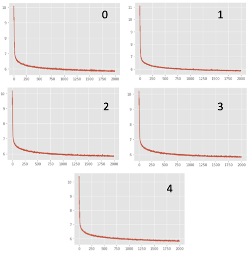

# Deep ensembles: learning the dynamics of a cartpole with uncertainty using machine learning

## Methodology

Deep ensembles [1], as an alternative to Bayesian NNs, is simple to implement, readily parallelizable, requires very little hyperparameter tuning, and yields high quality predictive uncertainty estimates. For regression problems such as the studied cartpole problem, we use a network ensemble that captures not only the predicted means but also variances. By treating the observed value as a sample from a Gaussian distribution, we minimize a negative log-likelihood (NNL) criterion. Furthermore, we approximate the ensemble prediction as a Gaussian whose mean and variance are respectively the mean and variance of the mixture.

## Infrastructure and results

We first obtain 5000 training examples from the cartpole simulator. The train dataset includes a combination of random_policy and swingup_policy. We then build and train the networks of the deep ensembles in Google Colab using the training dataset. Furthermore, we merge the trained model with the visualization and testing codes in CartpoleSim from [here](https://github.com/DanWang1230/AI_based_mobile_robotics/tree/master/Homework%201).

We use an ensemble of 5 networks. In each network, the input dimension is 6, and the output dimension is 8. The outputs here include both means and variances. The network architecture is 3-hidden layer NN with ReLU nonlinearity, containing 1000 hidden units. The 5000 training data is split into 100 batches (with batch size of 50). After some trials, we choose Adam optimizer. We trained the nn ensemble for 2000 epochs.

The change of loss with respect to epoch number is shown below.

A video output is shown [here](Figures/deep_ensembles.mp4).